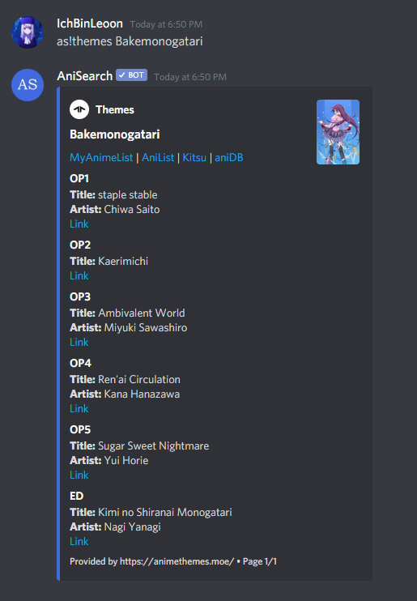

<p align="center">
  <br>
    
  <br>
</p>
  
<h5 align="center">Retrieves and displays information about anime, manga, characters, staff, studios and much more!</h5>
  
<p align="center">
  <a href="https://top.gg/bot/737236600878137363">
    
  </a>
  <a href="https://www.python.org/">
    =&nbsp;3.8-blue?style=flat-square" alt="Python">
  </a>
  <a href="https://github.com/IchBinLeoon/anisearch-discord-bot/blob/main/LICENSE">
    
  </a>
  <a href="https://www.codefactor.io/repository/github/ichbinleoon/anisearch-discord-bot">
    
  </a>
  <a href="https://github.com/IchBinLeoon/anisearch-discord-bot/actions">
    
  </a>
  <a href="https://github.com/IchBinLeoon/anisearch-discord-bot/pulls">
    
  </a>
  <a href="https://github.com/IchBinLeoon/anisearch-discord-bot/issues">
    
  </a>
</p>

<p align="center">
  <a href="#-AniSearch-v16">AniSearch 🔍</a>
  •
  <a href="#-Commands">Commands ✨</a>
  •
  <a href="#-Contribute">Contribute 🤝</a>
  •
  <a href="#-Running-AniSearch">Running AniSearch 🚀</a>
  •
  <a href="#-Libraries-and-APIs">Libraries and API's 📚</a>
  •
  <a href="#-License">License 📝</a>
</p>


# 🔍 AniSearch
**AniSearch** is an easy-to-use Discord bot written in Python that allows you to search for anime, manga, characters, staff, studios and much more directly in Discord and displays the results as paginated embeds! 

You can also:
- Search for a random anime or manga of a specific genre.
- View the opening and ending themes of an anime.
- View another user's profile with anime and manga stats from [AniList](https://anilist.co), [MyAnimeList](https://myanimelist.net) or [Kitsu](https://kitsu.io).
- Search for the anime or the source of an image.
- View the next airing, and the most recently aired anime episodes.
- View the latest anime related news from [Anime News Network](https://www.animenewsnetwork.com) and [Crunchyroll](https://www.crunchyroll.com).  

If you are interested in my bot, you can add it to your Discord server by clicking [here](https://discord.com/oauth2/authorize?client_id=737236600878137363&permissions=124992&scope=bot)!

<br>

[](https://top.gg/bot/737236600878137363)


# ✨ Commands
**AniSearch's Command Prefix:** `as! | @AniSearch | Customizable`

**Parameters:** `<> - required, [] - optional, | - either/or`

Do __not__ include `<>`, `[]` or `|` when executing the command.

### Search
- `anime <title>:` Searches for an anime with the given title and displays information about the search results such as type, status, episodes, description, and more!  
   <details close>
   <summary>Anime Example</summary>
   <br>
   
   </details>

- `manga <title>:` Searches for a manga with the given title and displays information about the search results such as type, status, chapters, description, and more!  
   <details close>
   <summary>Manga Example</summary>
   <br>
   
   </details>

- `character <name>:` Searches for a character with the given name and displays information about the search results such as description, synonyms, and appearances!  
   <details close>
   <summary>Character Example</summary>
   <br>
   
   </details>

- `staff <name>:` Searches for a staff with the given name and displays information about the search results such as description, staff roles, and character roles!  
   <details close>
   <summary>Staff Example</summary>
   <br>
   
   </details>

- `studio <name>:` Searches for a studio with the given name and displays information about the search results such as the studio productions!  
   <details close>
   <summary>Studio Example</summary>
   <br>
   
   </details>

- `random <anime|manga> <genre>:` Displays a random anime or manga of the specified genre.  

- `themes <anime>:` Searches for the openings and endings of the given anime and displays them.  
   <details close>
   <summary>Themes Example</summary>
   <br>
   
   </details>

- `theme <OP|ED> <anime>:` Displays a specific opening or ending of the given anime.
   <details close>
   <summary>Theme Example</summary>
   <br>
   
   </details>

### Profile
- `anilist [username|@member]:` Displays information about the given AniList profile such as anime stats, manga stats and favorites.  

- `myanimelist [username|@member]:` Displays information about the given MyAnimeList profile such as anime stats, manga stats and favorites.  

- `kitsu [username|@member]:` Displays information about the given Kitsu profile such as anime stats, manga stats and favorites!  

- `setprofile <al|mal|kitsu> <username>:` Sets an AniList, MyAnimeList or Kitsu profile.  

- `removeprofiles:` Removes the set AniList, MyAnimeList and Kitsu profile.  

### Image
- `trace <image-url|with image as attachment>:` Tries to find the anime the image is from through the image url or the image as attachment.  

- `source <image-url|with image as attachment>:` Tries to find the source of an image through the image url or the image as attachment.  

### Schedule
- `next:` Displays the next airing anime episodes.  

- `last:` Displays the most recently aired anime episodes.  

### News
- `aninews:` Displays the latest anime news from Anime News Network.  

- `crunchynews:` Displays the latest anime news from Crunchyroll.  

### Help
- `help [command]:` Shows help or displays information about a command.  

- `commands:` Displays all commands.  

- `about:` Displays information about the bot.  

- `stats:` Displays statistics about the bot.  

### Settings
Can only be used by a server administrator.

- `setprefix <prefix>:` Changes the current server prefix. Max 5 characters.  

### Admin
Can only be used by the bot owner.  

- `status:` Displays the current status of the bot.  

- `load <cog>:` Loads a cog.  

- `unload <cog>:` Unloads a cog.  

- `reload <cog>:` Reloads a cog.


# 🤝 Contribute
You have an idea or found a bug? Create [a new issue](https://github.com/IchBinLeoon/anisearch-discord-bot/issues) with detailed explanation.


# 🚀 Running AniSearch
Self-hosting isn't fully supported. I would prefer if you don't run an instance of my bot and recommend everyone to use the official instance instead, which you can add it to your Discord server [here](https://discord.com/oauth2/authorize?client_id=737236600878137363&permissions=124992&scope=bot)!  

Nevertheless, the installation steps are as follows:  

## Introduction
The bot and the associated admin web dashboard can either be run as Docker containers or manually. The dashboard can be accessed via the default port 5000.

### Requirements:
  - PostgreSQL Database
  - Either `Docker and Docker-Compose` or `Python 3.8+`

## 1. 💾 Set up Database
To be able to use the bot you need to set up a `PostgreSQL Database`.

Make sure the tables are set up correctly as shown below to successfully connect to your PostgreSQL Database.
Type the following in your `PSQL Tool`:

```sql
CREATE TABLE IF NOT EXISTS guilds (id bigint, prefix VARCHAR (5))
CREATE TABLE IF NOT EXISTS users (id bigint, anilist VARCHAR (255), myanimelist VARCHAR (255), kitsu VARCHAR (255))
```

## 2. ⚙️Set up Bot and Dashboard

1. Clone the repository.    

    ```
    $ git clone https://github.com/IchBinLeoon/anisearch-discord-bot
    ```

2. Create a [Discord Application](https://discord.com/developers/applications).

3. Rename `.env.example` to `.env`.  

4. Edit `.env`.  

    ```
    # The token the bot will use for auth with Discord.
    TOKEN=
    
    # The Discord ID of the user hosting the bot.
    OWNER_ID=
    
    # The Postgres database credentials.
    DB_HOST=
    DB_NAME=
    DB_USER=
    DB_PASSWORD=
    
    # The SauceNAO API key. Is required for the `source` command.
    SAUCENAO=
    ```

## 3. Run
Run the bot and dashboard either as Docker containers or manually.

### 🐳 Docker
1. Make sure `Docker` and `Docker-Compose` are installed.

2. Build the images and run the bot and dashboard.

    ```
    $ docker-compose up --build
    ```
   
### 🔧 Manually
1. Make sure you have `Python 3.8` or higher.

2. Edit `.env` and change `IPC_HOST=` to `localhost` or to the IP address of the device the bot is running on.

2. Set up and activate a venv for the bot and the dashboard. Can be one for both or two separate.

    ```
    $ python3 -m venv venv
    $ source venv/bin/activate # On macOS and Linux
    $ .\venv\Scripts\activate # On Windows
    ```

3. Install the requirements.

    ```
    $ python -m pip install -r requirements.txt
    $ python -m pip install -r dashboard/requirements.txt
    ```

4. Run the bot and dashboard.

    ```
    $ python -m anisearch
    $ python dashboard/app.py
    ```
   

# 📚 Libraries and API's
Thanks to the people who made this discord bot possible.  
#### [Rapptz/discord.py](https://github.com/Rapptz/discord.py)  
#### [Rapptz/discord-ext-menus](https://github.com/Rapptz/discord-ext-menus)  
#### [aio-libs/aiohttp](https://github.com/aio-libs/aiohttp)  
#### [psycopg/psycopg2](https://github.com/psycopg/psycopg2)  
#### [Ext-Creators/discord-ext-ipc](https://github.com/Ext-Creators/discord-ext-ipc)  
#### [pgjones/quart](https://gitlab.com/pgjones/quart)  
#### [AniList/ApiV2-GraphQL-Docs](https://github.com/AniList/ApiV2-GraphQL-Docs)  
#### [jikan-me/jikan](https://github.com/jikan-me/jikan)  
#### [hummingbird-me/api-docs](https://github.com/hummingbird-me/api-docs)  
#### [AnimeThemes/animethemes-server](https://github.com/AnimeThemes/animethemes-server)  
#### [soruly/trace.moe](https://github.com/soruly/trace.moe)  
#### [SauceNAO](https://saucenao.com)
#### [Anime News Network](https://www.animenewsnetwork.com)
#### [Crunchyroll](https://www.crunchyroll.com)


# 📝 License
This project is licensed under the GNU General Public License v3.0 (GPL-v3.0). See the [LICENSE](https://github.com/IchBinLeoon/anisearch-discord-bot/blob/main/LICENSE) file for more details.
