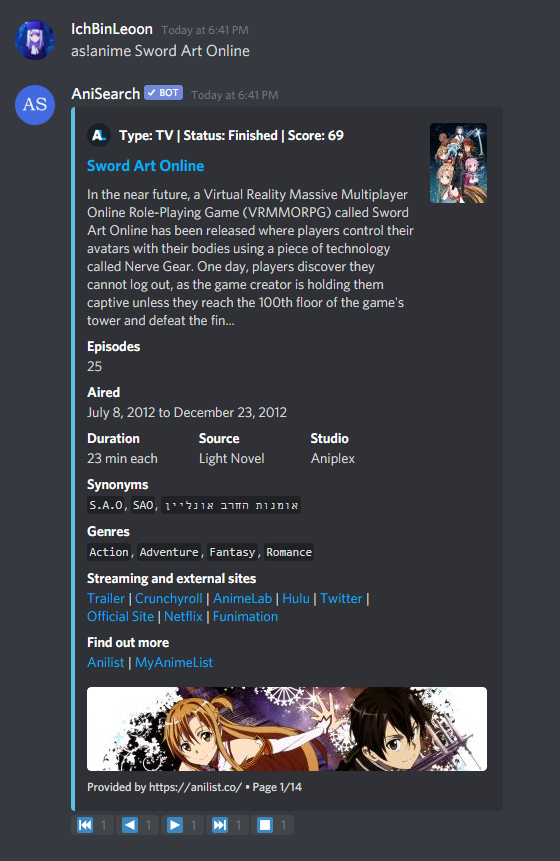
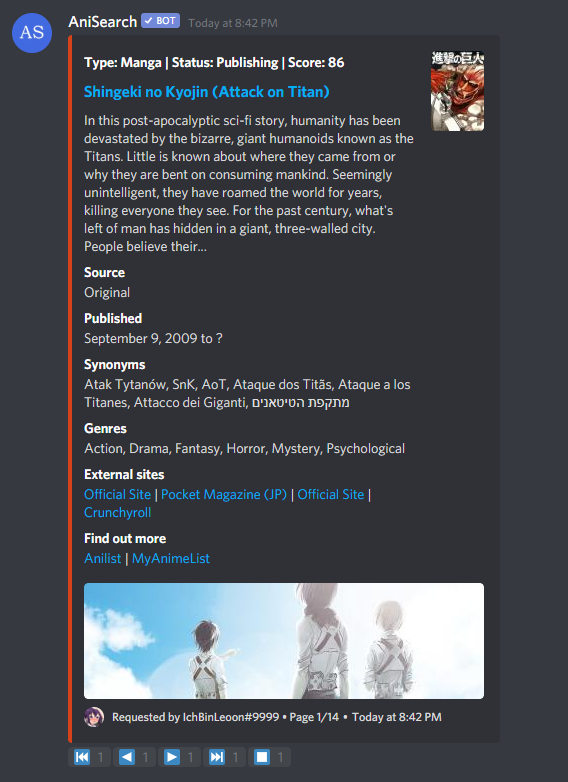
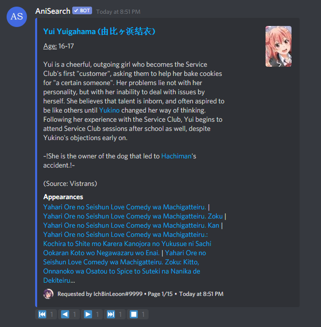
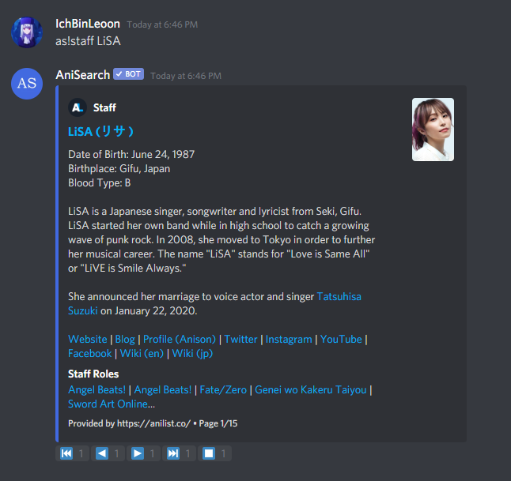
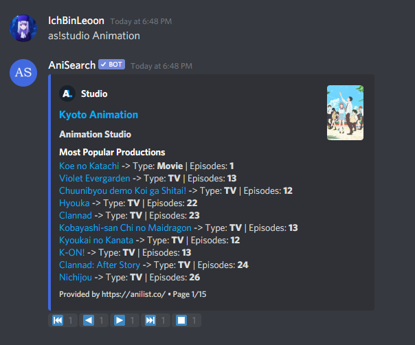

<p align="center">
  <br>
    
  <br>
</p>
  
<h5 align="center">Retrieves and displays information about anime, manga, characters, staff, studios and much more!</h5>
  
<p align="center">
  <a href="https://top.gg/bot/737236600878137363">
    
  </a>
  <a href="https://www.python.org/">
    =&nbsp;3.8-blue?style=flat-square" alt="Python">
  </a>
  <a href="https://github.com/IchBinLeoon/anisearch-discord-bot/blob/main/LICENSE">
    
  </a>
  <a href="https://www.codefactor.io/repository/github/ichbinleoon/anisearch-discord-bot">
    
  </a>
  <a href="https://github.com/IchBinLeoon/anisearch-discord-bot/actions">
    
  </a>
  <a href="https://github.com/IchBinLeoon/anisearch-discord-bot/pulls">
    
  </a>
  <a href="https://github.com/IchBinLeoon/anisearch-discord-bot/issues">
    
  </a>
</p>

<p align="center">
  <a href="#-AniSearch-v16">AniSearch 🔍</a>
  •
  <a href="#-Features">Features ✨</a>
  •
  <a href="#-Contribute">Contribute 🤝</a>
  •
  <a href="#-Running-AniSearch">Running AniSearch 🚀</a>
  •
  <a href="#-Libraries-and-APIs">Libraries and API's 📚</a>
  •
  <a href="#-License">License 📝</a>
</p>


# 🔍 AniSearch
**AniSearch** is an easy-to-use Discord bot written in Python that allows you to search for anime, manga, characters, staff and studios right within Discord and displays the results as interactive, reaction-based embeds! There are also features to search for a random anime or manga of a specific genre, view the opening and ending themes of an anime and to view another user's profile with anime and manga stats from [AniList](https://anilist.co), [MyAnimeList](https://myanimelist.net/) or [Kitsu](https://kitsu.io/). If you are interested in my bot, you can add it to your Discord server by clicking [here](https://discord.com/oauth2/authorize?client_id=737236600878137363&permissions=124992&scope=bot)!

[](https://top.gg/bot/737236600878137363)


# ✨ Features
## Commands
**AniSearch's Command Prefix:** `as! | @AniSearch | Customizable`

**Parameters:** `<> - required, [] - optional, | - either/or`

Do __not__ include `<>`, `[]` or `|` when executing the command.

### Search
- `anime <title>:` Searches for an anime with the given title and displays information about the search results such as type, status, episodes, description, and more!  

- `manga <title>:` Searches for a manga with the given title and displays information about the search results such as type, status, chapters, description, and more!  

- `character <name>:` Searches for a character with the given name and displays information about the search results such as description, synonyms, and appearances!  

- `staff <name>:` Searches for a staff with the given name and displays information about the search results such as description, staff roles, and character roles!  

- `studio <name>:` Searches for a studio with the given name and displays information about the search results such as the studio productions!  

- `random <anime|manga> <genre>:` Displays a random anime or manga of the specified genre.  

- `themes <anime>:` Searches for the openings and endings of the given anime and displays them.  

- `theme <OP|ED> <anime>:` Displays a specific opening or ending of the given anime.  

- `trace <image-url|with image as attachment>:` Tries to find the anime the image is from through the image url or the image as attachment.  

- `source <image-url|with image as attachment>:` Tries to find the source of an image through the image url or the image as attachment.  

### Help
- `help [command]:` Shows help or displays information about a command.  

- `commands:` Displays all commands.  

- `about:` Displays information about the bot.  

- `stats:` Displays statistics about the bot.  

### Settings
Can only be used by a server administrator.

- `prefix <prefix>:` Changes the current server prefix.  

### Admin
Can only be used by the bot owner.  

- `status:` Displays the current status of the bot.  

- `load <cog>:` Loads a cog.  

- `unload <cog>:` Unloads a cog.  

- `reload <cog>:` Reloads a cog.  

- `shutdown:` Shutdowns the bot.  

## Examples

<details close>
<summary>Anime</summary>
<br>

</details>

<details close>
<summary>Manga</summary>
<br>

</details>

<details close>
<summary>Character</summary>
<br>

</details>

<details close>
<summary>Staff</summary>
<br>

</details>

<details close>
<summary>Studio</summary>
<br>

</details>

# 🤝 Contribute
You have an idea or found a bug? Create [a new issue](https://github.com/IchBinLeoon/anisearch-discord-bot/issues) with detailed explanation.


# 🚀 Running AniSearch
Self-hosting isn't fully supported. I would prefer if you don't run an instance of my bot and recommend everyone to use the official instance instead, which you can add it to your Discord server [here](https://discord.com/oauth2/authorize?client_id=737236600878137363&permissions=124992&scope=bot)!  

Nevertheless, the installation steps are as follows:  

## 1. Setup Database
To be able to use the bot you need to set up a `PostgreSQL Database`.

Make sure the tables are set up correctly as shown below to successfully connect to your PostgreSQL Database.

### Database Table Structure

guilds

| id | prefix |
|--------------|--------------|
| bigint | character varying (255) |

users

| id | anilist | myanimelist | kitsu |
|--------------|--------------|--------------|--------------|
| bigint | character varying (255) | character varying (255) | character varying (255) |

### Query Tool

```sql
CREATE TABLE guilds (
    id bigint,
    prefix VARCHAR (255)
)

CREATE TABLE users (
    id bigint,
    anilist VARCHAR (255),
    myanimelist VARCHAR (255),
    kitsu VARCHAR (255)
)
```

## 2. Setup Bot
1. Clone the repository.    

    ```
    $ git clone https://github.com/IchBinLeoon/anisearch-discord-bot
    ```

2. Change the working directory.

    ```
    $ cd anisearch-discord-bot/anisearch
    ```

3. Create a [Discord Application](https://discord.com/developers/applications).

4. Rename `config.example.py` to `config.py`.  

5. Edit `config.py`.   

    ```py
    # The token the bot will use for auth with Discord.
    TOKEN = 'my cool bot token'

    # The Discord ID of the user hosting the bot.
    OWNER_ID = 'my discord id'

    # The Postgres database credentials.
    DB_HOST = 'hostname'
    DB_NAME = 'database'
    DB_USER = 'username'
    BD_PASSWORD = 'password'
    ```

## 3. Run

1. Change back to the parent directory.

    ```
    $ cd ..
    ```
   
2. Run the bot either as a Docker container or manually.

### 🐳 Docker
1. Make sure `Docker` and `Docker-Compose` are installed.

2. Build the image and run the bot.

    ```
    $ docker-compose up --build
    ```

### 🔧 Manually
1. Make sure you have `Python 3.8` or higher.

2. Install the requirements.

    ```
    $ python3 -m pip install -r requirements.txt
    ```

3. Run AniSearch.

    ```
    $ python3 -m anisearch
    ```


# 📚 Libraries and API's
Thanks to the people who made this discord bot possible.  
#### [Rapptz/discord.py](https://github.com/Rapptz/discord.py)  
#### [Rapptz/discord-ext-menus](https://github.com/Rapptz/discord-ext-menus)  
#### [aio-libs/aiohttp](https://github.com/aio-libs/aiohttp)  
#### [psycopg/psycopg2](https://github.com/psycopg/psycopg2)  
#### [AniList/ApiV2-GraphQL-Docs](https://github.com/AniList/ApiV2-GraphQL-Docs)  
#### [jikan-me/jikan](https://github.com/jikan-me/jikan)  
#### [hummingbird-me/api-docs](https://github.com/hummingbird-me/api-docs)  
#### [AnimeThemes/animethemes-server](https://github.com/AnimeThemes/animethemes-server)  
#### [soruly/trace.moe](https://github.com/soruly/trace.moe)  
#### [SauceNAO](https://saucenao.com)


# 📝 License
This project is licensed under the GNU General Public License v3.0 (GPL-v3.0). See the [LICENSE](https://github.com/IchBinLeoon/anisearch-discord-bot/blob/main/LICENSE) file for more details.
